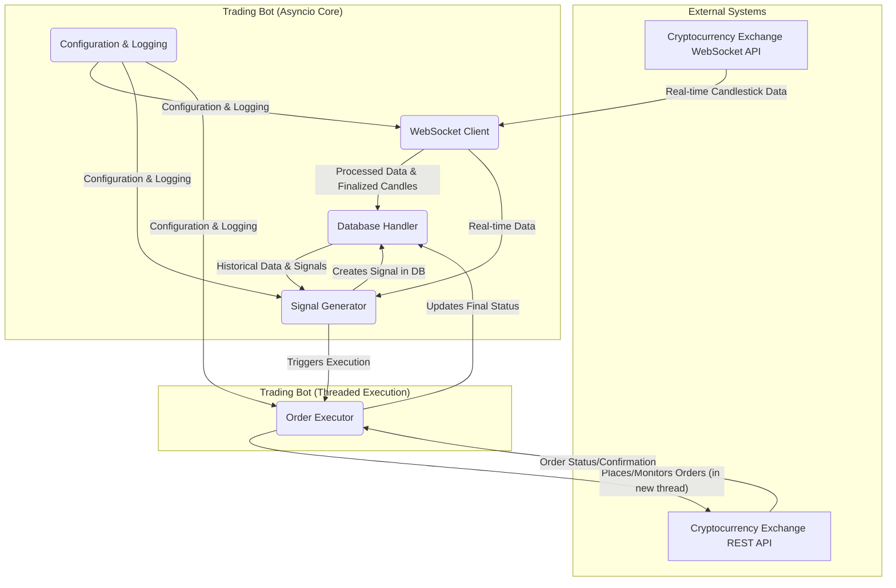

# Product Architecture Document: Real-time Crypto Trading Bot

## 1. Introduction

This document outlines the architectural design of the automated cryptocurrency trading bot. Its primary purpose is to provide a comprehensive overview of the system's components, their interactions, and the underlying principles guiding its development. This bot is designed to ingest real-time candlestick data, generate trading signals based on predefined logic, and eventually execute trades on a cryptocurrency exchange.

### 1.1. System Overview

The bot operates as a continuous, event-driven system. It connects to a cryptocurrency exchange's WebSocket API to receive live market data, processes this data to identify trading opportunities, and records all significant events and data points in a local SQLite database. The architecture emphasizes modularity, resilience, and extensibility to support future enhancements.

### 1.2. Goals and Objectives

*   **Real-time Data Ingestion:** Reliably collect and store high-frequency candlestick data from multiple cryptocurrency pairs.
*   **Accurate Signal Generation:** Implement robust logic to identify buy and sell signals based on technical criteria.
*   **Automated Order Execution (Future):** Securely place and manage trades on a cryptocurrency exchange.
*   **Resilience:** Handle disconnections, missed data, and API errors gracefully.
*   **Maintainability:** Ensure a modular and readable codebase for easy understanding and future modifications.
*   **Testability:** Design components that can be individually tested and verified.

## 2. High-Level Architecture

The system is composed of several interconnected modules, each with distinct responsibilities.

### 2.1. Major Components

*   **WebSocket Client (`websocket_client.py`):** Establishes and maintains connections to the exchange's WebSocket API, subscribes to data streams, and parses incoming raw messages.
*   **Database Handler (`database_handler.py`):** Manages the local SQLite database, handling connections, table creation, and CRUD operations for both candlestick data and trading signals.
*   **`signal_generator.py`**: Analyzes real-time and historical candlestick data to generate buy/sell signals. It then directly triggers the `Order Executor` to carry out the trade.
*   **`futures.py` (API Client):** A robust client that interacts with the exchange's REST API. It handles secure authentication, order placement, and status checks.
*   **`order_executor.py` (Execution Logic):** Contains the functions for the entire lifecycle of a trading order. It is not a standalone service but a library of functions called by the `Signal Generator`. Each call spawns a new thread to execute the trade, preventing it from blocking the main application.
*   **Configuration & Logging (`config.py`, `logger.py`, `.env`):** Provides centralized configuration settings and a robust logging mechanism for system monitoring and debugging.

## 3. Component Breakdown (Detailed)

### 3.1. Data Ingestion (Component 1 & 1.5)

*   **WebSocket Client (`websocket_client.py`):**
    *   **Role:** The primary interface for receiving real-time market data.
    *   **Responsibilities:**
        *   **Connection Management:** Establishes and maintains a persistent WebSocket connection to the exchange. Includes robust auto-reconnection with exponential backoff.
        *   **Subscription:** Subscribes to multiple cryptocurrency pairs and candlestick intervals as defined in `config.py`. Subscriptions are batched to prevent rate limiting.
        *   **Raw Data Parsing:** Extracts relevant candlestick data (`symbol`, `candle_start_time`, `open_price`, `high_price`, `low_price`, `close_price`, `volume`, `is_final_candle`, etc.) from raw WebSocket messages.
        *   **Data Routing:** Passes parsed data to the in-memory cache and the Signal Generator.
    *   **In-Memory Cache (`in_memory_cache` dictionary):**
        *   **Purpose:** Stores the latest real-time updates for *open* candles for each subscribed symbol. This reduces immediate database write load and provides instant access to current candle data for signal generation.
        *   **Structure:** A dictionary where keys are `f"{symbol}_{interval}"` (e.g., "BTCUSDT_5m") and values are dictionaries containing the `last_candle_start_time` and the `last_payload` (the most recent update for that candle).
    *   **Candle Finalization Logic (within `on_candles` handler):**
        *   **Explicit Finalization:** Processes and persists a candle when the exchange explicitly sends `x: true` (indicating a finalized candle).
        *   **Implicit Finalization (Resilience):** Crucially, if a new incoming message has a `candle_start_time` that is *later* than the `last_candle_start_time` in the cache for that symbol, it implies the previous candle has closed. In this scenario, the system takes the `last_payload` of the *previous* candle, sets its `x` flag to `true` (forcing finalization), and then persists it to the database. This prevents data loss if the explicit `x: true` message is missed due to network issues or high frequency.
        *   **Cache Management:** Clears the cache for a symbol once its candle is finalized and begins tracking the new candle.

### 3.2. Data Persistence (Database Handler)

*   **SQLite Database (`Crypto_Data.db`):**
    *   **Choice:** Selected for its lightweight, serverless, and embedded nature, suitable for local data storage in a single-machine application.
    *   **Purpose:** Stores historical candlestick data and the lifecycle of trading signals.
*   **`database_handler.py`:**
    *   **Responsibilities:**
        *   Manages all database interactions: connections, table creation, and CRUD operations.
        *   Provides functions to `insert_signal`, `get_latest_signal`, and a flexible `update_signal_execution_details` method to save fill information from the exchange.
    *   **Table Schemas:**
        *   **`CandleStick_Data_WebSocket`:** Stores finalized candlestick data.
        *   **`Signals`:**
            *   `Signal_ID` (INTEGER, PRIMARY KEY, AUTOINCREMENT)
            *   `Unique_PositionID` (TEXT, NOT NULL): Links a buy and its corresponding sell.
            *   `Symbol` (TEXT, NOT NULL)
            *   `Signal` (TEXT, NOT NULL): 'Buy' or 'Sell'.
            *   `Signal_Price` (REAL, NOT NULL)
            *   `Signal_Timestamp` (INTEGER, NOT NULL)
            *   `Trigger_Candle_Timestamp` (INTEGER)
            *   `Signal_Reason` (TEXT)
            *   `Position_Status` (TEXT, NOT NULL): `Pending_Execution`, `Open`, `Partially_Filled`, `Closed`, `Execution_Failed`, `Canceled`, `Critical_Error_Reconciliation_Needed`, `Critical_Error_Cancel_Failed`.
            *   `Filled_Quantity` (REAL): The actual amount filled by the exchange.
            *   `Exchange_Order_ID` (TEXT)
            *   `CoinSwitch_TransactionStatus` (TEXT)
            *   `CoinSwitch_TransactionPrice` (REAL)
            *   `CoinSwitch_TransactionTime` (INTEGER)

### 3.3. Signal Generation (Component 2)

*   **`signal_generator.py`:**
    *   **Core Logic:** Implements the trading strategy rules.
    *   **Staleness Check:** Before evaluating a buy signal from a closed candle, the generator checks if the candle's timestamp is within the `STALENESS_THRESHOLD_SECONDS` defined in `config.py`.
    *   **State Machine (`process_candle_data`):** The central decision-making unit, driven by the `Position_Status` of the latest signal for a symbol. It uses a per-symbol `asyncio.Lock` to prevent race conditions.
    *   **Critical Error Handling:** The state machine currently handles `Pending_Execution`, `Open`, `Partially_Filled`, and `Execution_Failed` states. It does not yet implement the logic to halt signal processing for a symbol if its latest position is in a `Critical_Error_...` state; this remains a key safety feature to be implemented.
    *   **Buy/Sell Criteria:** Implements the defined logic for entering and exiting positions based on candle data and real-time price updates.

*   **Multi-Stage Exit Strategy:** To enhance profit-taking, the generator employs a dynamic, multi-stage exit strategy defined in `config.py`. This allows the system to let winning trades run while systematically protecting profits by applying tighter stop-losses as the trade becomes more profitable.
    1.  **Stage 0 (Initial Stop-Loss):** Before any profit targets are met, the system uses the standard, wider `TRAILING_STOP_LOSS_PERCENTAGE` to protect against initial losses.
    2.  **Stage Activation:** The system continuously checks the trade's performance against a list of configured profit tiers (`TAKE_PROFIT_STAGES`). When a trade's price reaches a new profit percentage threshold (e.g., 5%, 15%, 50%), the system records that profit level in the `take_profit_activated` column for that position in the database.
    3.  **Stage N (Profit Protection):** Once a profit stage is activated, the exit logic switches to using the corresponding `profit_trail_percentage` from that tier. The system always uses the trail percentage from the *highest* activated tier, ensuring the stop-loss only ever gets tighter, not looser. This allows the system to lock in gains more aggressively as the trade moves further into profit.

### 3.4. Order Execution (Component 3)

*   **`order_executor.py`:** This module contains the procedural logic for the entire lifecycle of an order. It is not an independent, running service but rather a library of functions that are called directly by the `signal_generator`.

*   **Threaded, "Fire-and-Forget" Execution:** To prevent the I/O-bound process of placing and monitoring an order from blocking the main `asyncio` event loop, the system uses a multi-threading approach.
    1.  When the `signal_generator` decides to execute a trade, it calls the appropriate function (e.g., `execute_buy_signal`) from the `order_executor`.
    2.  This function immediately spawns a **new, independent background thread** (`threading.Thread`) dedicated solely to the execution of that single trade.
    3.  The main `asyncio` loop is now free to continue processing real-time WebSocket data without waiting for the trade to complete.

*   **Transactional Order Flow (within the thread):** The logic running inside each thread is a strict, transactional sequence designed for safety.
    1.  **Start Timer:** The task begins a countdown based on `BUY_SIGNAL_EXECUTION_THRESHOLD_SECONDS`.
    2.  **Pre-Flight Checks:** It calls `futures.futures_wallet_balance()` and `futures.futures_update_leverage()`. A failure at this stage updates the signal's `Position_Status` to `'Execution_Failed'`.
    3.  **Market Order Placement:** It calls `futures.futures_create_order()`. If this call fails, the status is updated to `'Execution_Failed'`.
    4.  **Monitoring, Reconciliation, and Timeout:**
        *   The thread begins polling `futures.get_order_by_id()` to determine the order's status.
        *   **Success:** If the order status becomes `EXECUTED`, the process is complete. The `Signals` table is updated to `'Open'` with all fill details.
        *   **Partial Fill:** If the status becomes `PARTIALLY_FILLED`, the `Signals` table is updated, and the position is considered open.
        *   **Timeout Logic:** If the execution timer expires and the order's final status is still ambiguous (e.g., `RAISED` or `PENDING`), the `Position_Status` is updated to **`'Critical_Error_Reconciliation_Needed'`**. This is a key safety mechanism to prevent the bot from taking further action on an unknown state, flagging it for manual human intervention.

### 3.5. Configuration & Logging

*   **`config.py`:** Centralized location for all configurable parameters.
*   **`logger.py`:** Provides a standardized logging setup for the entire application.
*   **`.env`:** Stores sensitive information like API keys and secret keys securely.

### 3.6. Main Application Flow (`app.py`, `main.py`)

*   **`main.py`:** The entry point of the application. Initializes the `App` class and manages the `asyncio` event loop.
*   **`app.py`:** Orchestrates the initialization and connection of all major components. Manages graceful shutdown.

### 3.7. File Manifest

This section provides a breakdown of all files within the project, clarifying their purpose and categorizing them based on their role in the system.

#### Core System Files
These files are essential for the real-time, continuous operation of the trading bot.

*   **`main.py`**: The main entry point that starts the application. It initializes the `App` object and manages the main `asyncio` event loop.
*   **`app.py`**: The central orchestrator. It initializes and connects all major components like the database, WebSocket client, and signal generator.
*   **`websocket_client.py`**: Responsible for connecting to the exchange's WebSocket API, receiving real-time candlestick data, and managing the data stream.
*   **`database_handler.py`**: Manages all interactions with the SQLite database, including creating tables and handling all data storage and retrieval for candles and signals.
*   **`signal_generator.py`**: Contains the core trading logic. It analyzes data to generate buy and sell signals based on the defined strategy.
*   **`order_executor.py`**: Executes the buy and sell orders on the exchange based on signals from the `signal_generator`.
*   **`futures.py`**: The REST API client for communicating with the exchange to place orders, check balances, and get order statuses.
*   **`config.py`**: A centralized file for storing all application configuration parameters, such as symbol lists, leverage, and feature flags like `DRY_RUN`.
*   **`logger.py`**: Sets up the application-wide logging configuration.
*   **`requirements.txt`**: Lists all the Python packages required to run the bot.
*   **`.env`**: Contains sensitive information, primarily the API and secret keys for the exchange. This file is required for the bot to run but is excluded from version control.

#### Data & Utility Scripts
These files are typically used for one-off tasks, such as bootstrapping the system with historical data.

*   **`get_data.py`**: A utility script likely used to perform a one-time fetch of historical data from the exchange. It is not part of the main bot's real-time execution loop.

#### Project & Documentation Files
These files provide context, planning, and documentation for the project.

*   **`EPIC.md`**: The high-level project management document tracking major features (epics) and user stories.
*   **`Product_Architecture.md`**: This document, which outlines the system's design and architecture.
*   **`.gitignore`**: Specifies which files and directories should be ignored by the Git version control system.

## 4. Key Architectural Decisions & Rationale

*   **Hybrid `asyncio` and `threading` Model:** The core application uses `asyncio` for handling high-frequency, non-blocking WebSocket I/O. However, trade execution involves a sequence of blocking, synchronous REST API calls. To prevent these from stalling the main event loop, each trade is executed in a separate, isolated background thread.
*   **SQLite for Local Persistence:** A simple, lightweight, and embedded database solution ideal for this application's scope.
*   **In-Memory Cache for Real-time Data:** Provides low-latency access to the latest candle updates for signal generation.
*   **Per-Symbol `asyncio.Lock`:** Essential for preventing race conditions in the signal generation logic.
*   **Explicit State Machine in Signal Generator:** Provides a clear and robust way to manage the trading lifecycle, preventing duplicate or premature actions. The handling of `Critical_Error` statuses makes this state machine a key safety feature.
*   **Separation of Concerns:** Each component has a well-defined responsibility, promoting modularity and testability.

## 5. Data Flow

1.  **WebSocket Data Ingestion:** `websocket_client.py` receives real-time candlestick data.
2.  **Real-time Processing:** The data is passed to `signal_generator.process_candle_data`.
3.  **Signal Generation & State Management:**
    *   `signal_generator.py` acquires a lock for the symbol.
    *   It queries `database_handler.get_latest_signal` to check the current `Position_Status`.
    *   **If the status is a `Critical_Error`, it halts processing for that symbol.**
    *   Otherwise, it checks for buy or sell conditions based on the current state.
    *   If a signal is generated, it's inserted into the `Signals` table with `Position_Status: 'Pending_Execution'`.
4.  **Candle Finalization & Persistence:** Finalized candles are stored in the `CandleStick_Data_WebSocket` table.
5.  **Order Execution:**
    *   The `signal_generator` immediately calls the appropriate function (e.g., `execute_buy_signal`) in the `order_executor` module.
    *   The `order_executor` spawns a new background thread to handle the entire trade lifecycle.
    *   This thread uses the `futures.py` client to interact with the exchange.
    *   After the trade is complete, fails, or times out, the thread updates the final status (e.g., `Filled_Quantity`, `Position_Status: 'Open'`, etc.) in the `Signals` table by calling `database_handler.update_signal_execution_details`.

## 6. Security Considerations

*   **API Key Management:** API keys and secrets are stored in a `.env` file and excluded from version control.
*   **Secure Signing:** All sensitive API requests are signed using the **Ed25519** digital signature algorithm.
*   **Robust API Client:** The API client in `futures.py` is designed to be robust, using **custom exceptions** to handle specific API errors (e.g., `AuthenticationError`, `RateLimitError`), which allows the rest of the system to react to failures in a safe and predictable way.
*   **No Hardcoding:** Credentials are never hardcoded.

## 7. Scalability & Performance

*   **Current State:** The design is suitable for a single-instance deployment. `asyncio` and SQLite are efficient for the current scope.
*   **Future Considerations:** For significant scaling, one might consider migrating to a networked database (e.g., PostgreSQL) and a message queue (e.g., RabbitMQ) for inter-service communication.

## 8. Error Handling & Resilience

*   **WebSocket Reconnection:** Ensures continuous data flow.
*   **Robust Candle Finalization:** Prevents data loss from missed WebSocket messages.
*   **State-Aware Order Execution:** The timeout and reconciliation logic for order execution is designed to handle ambiguity safely by escalating to a human when necessary.
*   **Custom API Exceptions:** The API client provides specific, catchable exceptions for different failure modes, enabling fine-grained error handling throughout the application.
*   **Logging:** Extensive logging provides visibility into system operations and errors.

## 9. Testing Strategy

*   **Unit Testing:** Individual functions and methods are designed to be testable in isolation.
*   **User Acceptance Testing (UAT.md):** Provides step-by-step guides for manual verification.
*   **Dry Run Mode:** Allows for safe, simulated testing of the order execution logic.
*   **Backtesting (Future):** A dedicated framework for testing trading strategies against historical data.

## 10. Future Enhancements (Beyond Current Epic)

*   **Risk Management:** Implement advanced risk controls (e.g., stop-loss, take-profit, position sizing).
*   **Monitoring & Alerting:** Develop a dashboard for real-time system health and P&L.
*   **Persistence of State:** Enhance state persistence for full recovery after unexpected shutdowns.
*   **User Interface/Dashboard:** A UI for visual monitoring and interaction.
*   **Telegram Bot Integration:** The architecture for a Telegram bot has been designed to operate in a separate, non-blocking thread, ensuring it does not interfere with core trading operations. This would allow for real-time notifications and interactive commands (e.g., `/status`, `/profit`). The implementation would use `python-telegram-bot` and a thread-safe queue for communication between the main app and the Telegram thread.