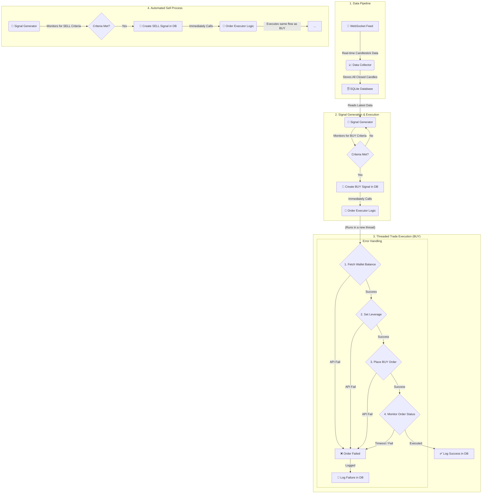

# 🤖 CryptoSignal Trader

👤 **Author**

**Abhay Singh**
- 📧 Email: [abhay.rkvv@gmail.com](mailto:abhay.rkvv@gmail.com)
- 🐙 GitHub: [AbhaySingh989](https://github.com/AbhaySingh989)
- 💼 LinkedIn: [Abhay Singh](https://www.linkedin.com/in/abhay-pratap-singh-905510149/)
__________________________________________________________________

📖 **About**

CryptoSignal Trader is a powerful, automated cryptocurrency trading bot designed for the CoinSwitch Pro exchange. It connects to CoinSwitch's WebSocket feed to process real-time market data, generates trading signals based on candlestick analysis, and executes trades automatically via the REST API.

This bot is built for traders who want to deploy custom strategies and automate their trading activity 24/7. It is highly configurable and includes a dry-run mode for safe testing.

✨ **Features**

🚀 **Core Functionality**

- **Real-Time Data Processing**: Connects to the CoinSwitch WebSocket for live candlestick data across hundreds of trading pairs.
- **Automated Signal Generation**: Monitors candlestick data to automatically generate BUY and SELL signals based on predefined criteria.
- **Automated Trade Execution**: Places and monitors orders automatically through the CoinSwitch REST API.
- **Database Logging**: Logs all incoming candlestick data and generated trade signals to a local SQLite database for analysis and persistence.

🛠️ **Configuration & Control**

- **Highly Configurable**: Easily configure trading pairs, intervals, leverage, order amounts, and more in a central `config.py` file.
- **Dry-Run Mode**: Test your strategies safely without risking real funds by enabling the `DRY_RUN` mode.
- **Trailing Stop-Loss**: Includes a configurable trailing stop-loss to protect profits.

🔒 **Reliability**

- **Graceful Shutdown**: Shuts down gracefully on interruption, ensuring no data is lost.
- **Robust Error Handling**: Implements error handling for API calls and WebSocket connections.
- **Persistent Storage**: Uses a SQLite database to store data, ensuring persistence across sessions.

📊 **How It Works**

This diagram illustrates the complete workflow of the CryptoSignal Trader, from data collection to trade execution.



---

🛠️ **Installation & Setup**

Follow these steps to get your trading bot up and running.

**Prerequisites**

- [Python 3.8+](https://www.python.org/downloads/)
- A [CoinSwitch Pro](https://coinswitch.co/pro) account

**Step 1: Clone the Repository**

```bash
git clone https://github.com/your-username/CryptoSignal-Trader.git
cd CryptoSignal-Trader
```
*(Note: The repository URL is a placeholder and should be updated.)*

**Step 2: Install Dependencies**

It is recommended to use a virtual environment to keep dependencies isolated.

```bash
# Create a virtual environment (optional but recommended)
python -m venv venv
source venv/bin/activate  # On Windows, use `venv\Scripts\activate`

# Install the required packages
pip install -r requirements.txt
```

**Step 3: Configure Environment Variables**

The bot requires API keys to interact with the CoinSwitch Pro exchange.

1.  **Create a `.env` file** in the root of the project directory.
2.  **Add your API keys** to the `.env` file as shown below.

```
# .env file
API_KEY="your_api_key_here"
SECRET_KEY="your_secret_key_here"
```

🔑 **Getting Your API Keys**

You can generate your `API_KEY` and `SECRET_KEY` directly from your **CoinSwitch Pro profile**.

> **⚠️ Important:** Never commit your `.env` file or share your API keys publicly. The `.gitignore` file is already configured to ignore `.env` files.

**Step 4: Customize Trading Configuration (Optional)**

You can customize the bot's trading strategy by editing the `config.py` file. Here, you can change:
- `SYMBOLS`: The list of cryptocurrency pairs to trade.
- `INTERVAL`: The candlestick interval (e.g., "1", "5", "15" minutes).
- `LEVERAGE`: The leverage to be used for trades.
- `ORDER_AMOUNT`: The amount to be used for each order.
- And other advanced settings.

---

🚀 **Usage**

**1. Starting the Bot**

Once you have completed the installation and setup, you can start the bot by running:

```bash
python main.py
```

The bot will connect to the WebSocket, start collecting data, and execute trades based on your configuration. You will see log messages in the console and in the `data_collector.log` file.

**2. Dry Run vs. Live Trading**

The bot can be run in two modes, which can be configured in the `config.py` file:

-   **Dry Run Mode** (`DRY_RUN = True`): This is the **default and recommended** mode for testing. The bot will simulate trades without using real funds. It will log the trades it *would* have made, so you can test your strategy safely.

-   **Live Trading Mode** (`DRY_RUN = False`): In this mode, the bot will execute real trades with your funds on the CoinSwitch Pro exchange.

> **⚠️ Warning:** Only use Live Trading Mode after you have thoroughly tested your strategy in Dry Run Mode and understand the risks involved.

---

📊 **Performance Dashboard**

This project includes a powerful, web-based dashboard for analyzing your trading bot's performance.

- **Performance Analysis**: Visualize P&L, win rates, and trade history.
- **Strategy Optimization**: Run backtests on historical data to find the most profitable trading parameters.

For detailed instructions on how to set up and use the dashboard, please see the **[Dashboard README](./Dashboard/Dashboard_Readme.md)**.

---

📁 **Project Structure**

Here is an overview of the key files in the project:

```
CryptoSignal-Trader/
├── 📜 main.py                # Main entry point for the application
├── 🚀 app.py                 # Core application class; initializes all components
├── 🔧 config.py              # All trading parameters and configurations
├── 🔌 websocket_client.py    # Handles WebSocket connection and data collection
├── 🗄️ database_handler.py    # Manages the SQLite database
├── 🤖 signal_generator.py    # Logic for generating signals and triggering trade execution
├── 📈 order_executor.py      # Contains the logic for executing trades in separate threads
├── 📞 futures.py             # API client for communicating with the exchange (placing orders, etc.)
├── 📝 logger.py              # Logging configuration
├── 📋 requirements.txt       # Python dependencies for the bot
└── 📊 Dashboard/             # Contains the web-based performance analysis dashboard
```

---

🐛 **Troubleshooting**

If you encounter any issues, here are a few things to check:

-   **Bot not starting or crashing immediately**:
    -   Ensure all dependencies are installed correctly with `pip install -r requirements.txt`.
    -   Verify that you have created a `.env` file in the root directory and that it contains your `API_KEY` and `SECRET_KEY`.

-   **Authentication Errors**:
    -   Double-check that your `API_KEY` and `SECRET_KEY` are correct.
    -   Ensure your API keys have the necessary permissions for trading on CoinSwitch Pro.

-   **WebSocket Connection Issues**:
    -   Check your internet connection.
    -   Look at the console logs for any specific error messages from the WebSocket client.

-   **No Trades Executed**:
    -   Make sure you are running in Live Mode (`DRY_RUN = False` in `config.py`).
    -   Check the `data_collector.log` file for any errors or messages that might indicate why a signal is not being generated or an order is failing.
    -   Your trading criteria might not be met. Consider adjusting your strategy in `signal_generator.py` or parameters in `config.py`.

---

🤝 **Contributing**

Contributions are welcome! If you have a feature request, bug report, or want to contribute to the code, please follow these steps:

1.  **Fork the repository**.
2.  **Create a new branch** for your feature or bug fix:
    ```bash
    git checkout -b feature/your-amazing-feature
    ```
3.  **Make your changes** and commit them with a clear message:
    ```bash
    git commit -m "Add some amazing feature"
    ```
4.  **Push to your branch**:
    ```bash
    git push origin feature/your-amazing-feature
    ```
5.  **Open a Pull Request**.


---

Made with ❤️ by [Abhay Singh](https://github.com/AbhaySingh989)
